<div align="center">

</div>

# LucidUI

A UI library for Roblox scripts. Glass-themed, no key system, no dependencies beyond `loadstring`.

I built this because I got tired of interfaces that promise to work everywhere and then break the moment you try to load them on a second executor. So this one tries hard not to.

```lua
local LucidUI = loadstring(game:HttpGet(
    "https://raw.githubusercontent.com/Kyotaah/lucidui/main/dist/lucidui.lua"
))()

local Window = LucidUI:CreateWindow({ Name = "My Hub" })
Window:BuildSettingsPanel()

local Tab = Window:CreateTab({ Name = "Main", Icon = "zap" })
local Section = Tab:CreateSection({ Name = "Stuff" })

Section:CreateButton({
    Name = "Click",
    Callback = function()
        LucidUI:Notify({ Title = "Done", Message = "It clicked." })
    end,
})
```

That's basically the whole API surface for a simple hub. Everything else is variations on `CreateToggle`, `CreateSlider`, `CreateDropdown`, `CreateKeybind`, `CreateInput`, and `CreateTextDisplay`.

---

## What's in it

**Window.** Draggable, resizable, minimizable. The orange dot shrinks it to a compact bar sized to fit your hub's name. The red dot drops it into a floating pill that you can drag anywhere and tap to restore.

**Settings panel.** Opens from the gear icon. Has sections for Theme, Custom Theme, Saved Themes, Background Image, Keybinds, Configs, and About. Built once and cached.

**Themes.** 17 presets. Dark, Light, Nebula, Midnight, Dracula, Tokyo Night, Forest, Catppuccin Mocha, Catppuccin Latte, Nord, Gruvbox, Rosé Pine, One Dark, Synthwave '84, Solarized Dark, Ayu Mirage, Kanagawa. Switch with `Window:SetTheme("Nebula")` or from the dropdown.

**Custom theme editor.** Six color swatches — Background, Surface, Surface Hover, Accent, Border, Text. Tap one and an HSV picker opens with a hue strip, SV square, hex field, and live preview. Text colors auto-adjust if your pick has less than 4.5:1 contrast against the background, so it never becomes unreadable.

**Background images.** Paste a URL in settings. It handles `rbxassetid://`, raw asset IDs, and `https://` links. The Auto Accent button samples the image and picks an accent color that actually reads against your current theme.

**Notifications.** Top-right glass toasts. `LucidUI:Notify({ Title, Message, Duration })`.

**Intro screen.** Optional animated loading card with a blob that pulses to a fake bass line, a rotating border, and a particle burst when it finishes. Skip it by clicking or pressing any key. Disable with `IntroEnabled = false` on `CreateWindow`.

**Config slots.** Set `Flag = "something"` on any element and its value saves to disk and comes back on the next session.

**Mobile.** All the tap handling distinguishes taps from drags. Scrolling a button list won't fire buttons. Long-press isn't used for anything.

---

## Window options

```lua
LucidUI:CreateWindow({
    Name = "My Hub",            -- shows in title bar and floating pill
    Theme = "Nebula",           -- optional, defaults to Default
    PillKeybind = Enum.KeyCode.Home,
    Width = 620,
    Height = 460,
    IntroEnabled = true,        -- set false to skip the intro
    IntroTitle = "My Hub",      -- override intro card text
    IntroSubtitle = "v1.0",
    IntroTagline = "Loading...",
    IntroDuration = 2.8,
})
```

## Element options

Every element takes the same shape:

```lua
Section:CreateToggle({
    Name = "Auto Farm",
    Flag = "autofarm",       -- omit for no persistence
    Default = false,
    Callback = function(state)
        print(state)
    end,
})
```

Slider uses `Min` / `Max` / `Default` / `Increment`. Dropdown uses `Options` (table) and `Default`. Keybind uses `Default = Enum.KeyCode.X`. Input uses `Placeholder` and `Default`.

Every element returns an object with `:Set(value)` and `:Get()` so you can control it programmatically after creation.

---

## Executors

Tested mostly on Xeno and Delta. Should work anywhere that gives you `loadstring` and `game:HttpGet`.

| Desktop | Mobile |
| --- | --- |
| Xeno, Delta, Wave, Solara, KRNL, Fluxus, Synapse Z | Delta, Fluxus, Arceus X, Codex, E-Sign |

Three features need specific APIs, and each fails on its own without taking down the rest of the UI:

- Config saving needs `writefile` / `readfile` / `isfolder` / `makefolder`
- Background images from URLs need `getcustomasset`
- Auto accent detection needs `AssetService:CreateEditableImageAsync`

If any are missing, you get a toast saying so. The rest of the window keeps working.

---

## Icons

Tabs take an `Icon` name. Every icon is drawn out of Frames, no images or fonts.

```
dot  bars  diamond  cross  plus  check  shield  gavel
star  coins  person  eye  lock  unlock  play  pause
stop  bell  home  settings  sword  target  flame  crown  zap
```

Unknown names fall back to `dot`.

---

## Building

`python build.py` concatenates everything in `src/` (sorted by filename) into `dist/lucidui.lua`. The GitHub Action runs this on every push to `main`, so you never have to build locally unless you're testing a change.

The `src/` files, in order:

```
00_compat.lua         file I/O and JSON wrappers, executor-agnostic
01_helpers.lua        services, easing, constructors, glass renderer
01b_polish.lua        ripple, hover glow, sounds, BindTap
02_themes.lua         preset palettes and custom theme derivation
03_icons.lua          frame-based icons
04_intro.lua          the animated loading card
05_notifications.lua  toast system
06_window.lua         window shell, drag, resize, minimize, pill
07_settings_a.lua     theme dropdown, custom editor, HSV picker
07_settings_b.lua     background, keybinds, configs, accent detection
08_tab.lua            tabs and sections
09_elements.lua       buttons, toggles, sliders, dropdowns, inputs
```

If you're adding an element, put it in `09_elements.lua` and keep it consistent with what's already there. Sections use `self:_nextOrder()` for layout order and `self:_track(frame)` to attach. Theme updates go through `win:_registerTheme(fn)`. No external dependencies — everything has to work with just the standard Roblox APIs.

---

## License

MIT. Use it in paid scripts, don't need to credit me.

If something's broken or missing, open an issue. I read them.
